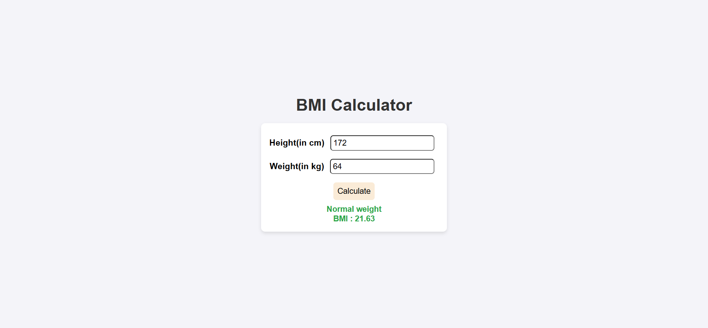
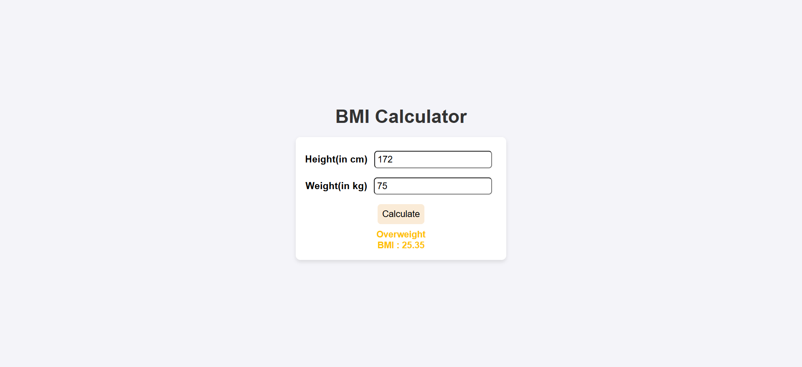

# 🧮 BMI Calculator

A simple **Body Mass Index (BMI) Calculator** built with **HTML, CSS, and JavaScript**.  
It takes a user's height (in cm) and weight (in kg) as input and calculates BMI along with the corresponding **health category**, displayed in color.

---
### 🖼️ Screenshots

  
  

---
## 📌 Features
- Input fields for **Height (cm)** and **Weight (kg)**
- **BMI Calculation** using the standard formula:
  \[
  BMI = \frac{weight (kg)}{height^2 (m^2)}
  \]
- **Validation** for empty/invalid values
- Displays:
  - Calculated **BMI value**
  - **Health category** (Underweight, Normal, Overweight, Obesity, Severe Obesity)
  - **Color-coded result** for better visualization

---

## 📊 BMI Categories & Colors

| Category        | BMI Range       | Color Code |
|-----------------|-----------------|------------|
| Underweight     | < 18.5          | 🟦 `#4da6ff` |
| Normal weight   | 18.5 – 24.9     | 🟩 `#28a745` |
| Overweight      | 25.0 – 29.9     | 🟨 `#ffc107` |
| Obesity         | 30.0 – 39.9     | 🟧 `#ff5733` |
| Severe Obesity  | ≥ 40            | 🟥 `#dc3545` |

---

## 🚀 How to Run
1. Clone or download the project.
2. Open `index.html` in your browser.
3. Enter your **height (cm)** and **weight (kg)**.
4. Click **Calculate** to view your BMI and category.

---

## 📂 Project Structure
BMI-Calculator/ 
│── index.html  
│── style.css  
│── script.js  
│── screenshots  
│── README.md  
