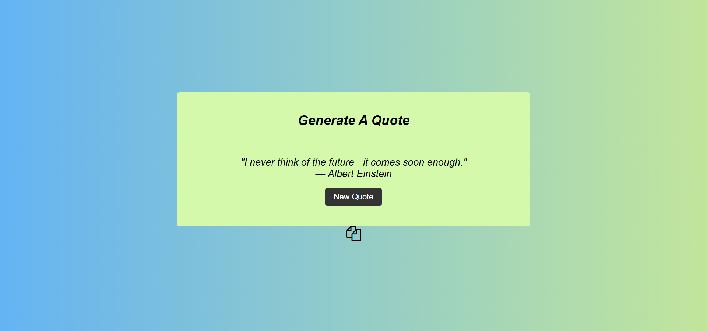

# 📜 Random Quote Generator

A simple web app that fetches random quotes from a free API and allows you to copy them to the clipboard with a **basic alert message**.

---

## 🚀 Features
- Fetches a random quote and its author from [FreeAPI](https://freeapi.app/).
- Click **Generate Quote** to display a new random quote.
- **Copy Quote** button copies the quote to your clipboard.
- Shows a **browser alert** (`✅ Quote copied to clipboard!`) after copying.

---

## 🖼️ Demo Screenshot
<p float="left">
  
  
</p>

---

## 🛠️ Technologies Used
- **HTML** – Page structure  
- **CSS** – Basic styling (if added)  
- **JavaScript** – Fetching quotes and clipboard functionality  
- **FreeAPI** – Random quote provider  

---

## 📂 Project Structure
📦 quote-generator<br>
┣ index.html<br>
┣ style.css<br>
┣ script.js<br>
┣ Screeshots<br>
┗ README.md<br>


---

## ⚡ How to Run
1. Clone this repository:
   ```bash
   git clone https://github.com/abhi-negii7/quote-generator.git
   cd quote-generator
2. Open index.html in your browser.

3. Click Generate Quote to fetch a random quote.

4. Click Copy Quote → you’ll see a browser alert confirming it’s copied.


