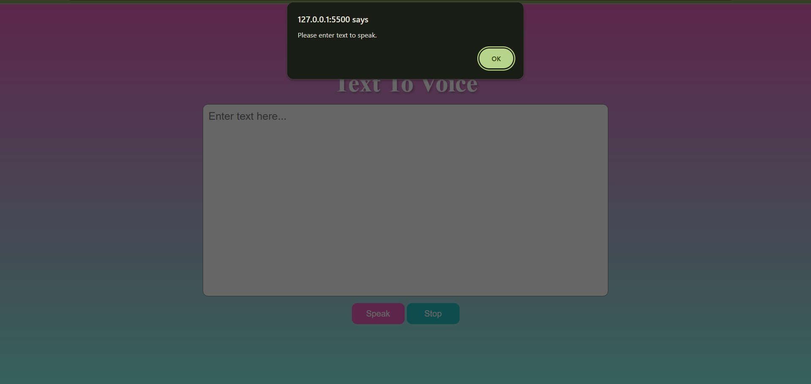

# 🗣️ Text to Voice

A simple and interactive web application built using **HTML**, **CSS**, and **JavaScript** that converts text into speech using the Web Speech API.

---

## 🚀 Features
- ✅ Convert typed or pasted text into speech.  
- ✅ **Speak button** – Starts reading the text aloud.  
- ✅ **Stop button** – Cancels any ongoing speech immediately.  
- ✅ Input validation – Alerts the user if the input is empty.  
- ✅ Whitespace trimming – Prevents accidental empty input.  
- ✅ Responsive UI with gradient background styling.  

---

## 🖼️ Demo Screenshot

  
  

---

## 🛠️ Technologies Used
- **HTML** – Provides structure and text input.  
- **CSS** – Adds gradient styling and button design.  
- **JavaScript** – Implements speech functionality using the Web Speech API.  

---

## 📂 Project Structure
TextToVoice/ 
│── index.html # Main HTML file 
│── style.css # Styling for UI 
│── script.js # JavaScript logic 
│── screenShot # Project screenshot 

---

## ⚙️ How It Works
1. Enter your text in the text area.  
2. Click **Speak** to hear the text read aloud.  
3. If text is blank, an alert will ask you to enter some input.  
4. Click **Stop** at any time to cancel the ongoing speech.  

---

## 📜 Code Explanation
- `SpeechSynthesisUtterance()` – Creates a speech request object.  
- `speechSynthesis.speak(voice)` – Starts speaking the given text.  
- `speechSynthesis.cancel()` – Stops any ongoing speech.  
- `.trim()` – Removes extra spaces to avoid empty input errors.  
- Input validation – Ensures user doesn’t try to speak empty text.  

---

## 💡 Future Enhancements
- 🎙️ Add multiple voice options (male/female, accents).  
- 🔊 Controls for speech rate, pitch, and volume.  
- 📝 Save typed text as an audio file (mp3/wav).  
- 📱 Improved mobile-friendly design.  

---

